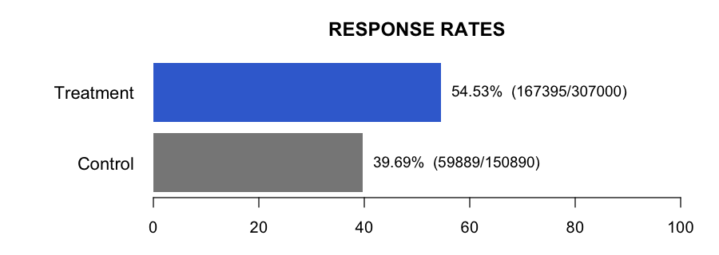

```{r setup, echo=FALSE, include=FALSE}
knitr::opts_chunk$set(echo = FALSE)
options(encoding = "UTF-8")
source("scripts/Two_sample_proportion_with_multiple_functions.R")
```

```{r computation, echo=FALSE, include=FALSE}
n.tx      <- 2300
n.ctrl    <- 45600
resp.tx   <- 1225
resp.ctrl <- 34500
threshold <- 0.05

validate_inputs(n.tx, n.ctrl, resp.tx, resp.ctrl)

contingency <- matrix(c(resp.tx, resp.ctrl, n.tx - resp.tx, n.ctrl - resp.ctrl),
                      nrow = 2, byrow = TRUE)
test_type   <- choose_test(contingency)
test_result <- run_selected_test(contingency, test_type)
confint     <- confidence_int(n.tx, n.ctrl, resp.tx, resp.ctrl, threshold)
interp      <- interpret_test(test_result$p_value, threshold)
expected_min <- min(chisq.test(contingency, correct = FALSE)$expected)
```

The treatment group included 2,300 patients, of whom 1,225 responded (53.26%; 95% CI 51.20%&ndash;55.32%). The control group included 45,600 patients, of whom 34,500 responded (75.66%; 95% CI 75.26%&ndash;76.05%). The null hypothesis was that the two groups have equal response probabilities; the alternative was that they differ. Because every expected cell count exceeded 5 (minimum 584.60), a chi-square test was appropriate, assuming independent groups and a binary outcome. The result was X&sup2; = 579.3856 (df = 1), p < 0.001 (&#42;&#42;&#42;), so we reject the null hypothesis. Receiving treatment or not is associated with the response.

### Contingency table

```{r contingency-table, echo=FALSE, results='asis'}
knitr::kable(
  data.frame(
    Group = c("Treatment", "Control"),
    Response = c(resp.tx, resp.ctrl),
    `No response` = c(n.tx - resp.tx, n.ctrl - resp.ctrl),
    check.names = FALSE
  ),
  format = "html",
  align = c("l", "r", "r")
)
```

### Response rates

```{r response-chart, echo=FALSE, results='asis'}
source(".codex/skills/statistical-analysis/scripts/response_rate_barplot.R")
plot_response_rates(resp.tx, n.tx, resp.ctrl, n.ctrl, file = "response_rates.png")
cat('')
```

### Summary

```{r summary-table, echo=FALSE, results='asis'}
result <- two_sample_proportion_test(n.tx, n.ctrl, resp.tx, resp.ctrl)

knitr::kable(
  data.frame(
    Metric = c("Total", "Response rate", "Risk difference"),
    Treatment = c(
      "2,300",
      "53.26% (95% CI 51.20%&ndash;55.32%)",
      "Absolute difference: 22.40 percentage points"
    ),
    Control = c(
      "45,600",
      "75.66% (95% CI 75.26%&ndash;76.05%)",
      "Treatment minus control: &minus;22.40 points (95% CI &minus;24.48 to &minus;20.33)"
    )
  ),
  format = "html",
  escape = FALSE,
  align = c("l", "r", "r")
)
```

The response-rate intervals use the Clopper&ndash;Pearson method, while the difference interval uses the Newcombe method.

**Test: Chi-square | Statistic: X&sup2; = 579.3856 (df = 1) | p-value < 0.001 (&#42;&#42;&#42;) | alpha = 0.05**

### Plain-language interpretation

The observed response rate was about 22.4 percentage points lower in the treatment group than in the control group. The p-value&mdash;the probability of observing a difference this large or larger by chance alone if there were truly no effect&mdash;is below 0.001, providing very strong evidence that the groups differ. We are 95% confident that the true treatment-minus-control difference lies between &minus;24.48 and &minus;20.33 percentage points. This establishes an association in these data, but causal interpretation requires appropriate randomization and freedom from major bias or confounding; statistical significance also does not by itself establish clinical importance.
