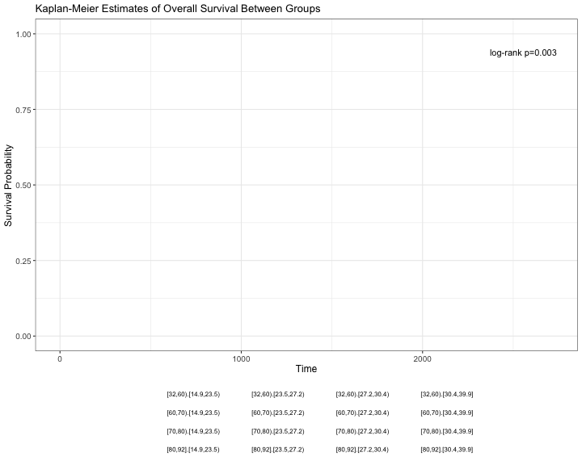

## Hypothesis Test Summary

**Null Hypothesis:** Survival curves are identical across all strata of agecat x bmicat.

**Alternative Hypothesis:** At least one survival curve differs.

| Statistic | Value |
|:---|:---|
| Chi-square statistic | 34.88 |
| Degrees of freedom | 15 |
| p-value | < 0.01 (&#42;&#42;) |
| Decision | **Reject Null Hypothesis** at alpha = 0.05 |

## Background and Methods

The dataset contains 100 patients admitted with acute myocardial infarction, with follow-up time (`lenfol`, days) as the time-to-event variable and vital status (`fstat`: 1 = deceased, 0 = censored/alive at last contact) as the event indicator. The two categorical covariates are `agecat` (four age bands: [32,60), [60,70), [70,80), [80,92]) and `bmicat` (four BMI categories: [14.9,23.5), [23.5,27.2), [27.2,30.4), [30.4,39.9]), yielding 16 strata in total. A **log-rank test with Bonferroni correction** was selected because two categorical covariates are present, producing more than two comparison groups. The three key assumptions are: (1) **Proportional Hazards** -- the hazard ratio between any two groups remains constant over time; (2) **Non-Informative Censoring** -- whether an observation is censored is unrelated to the underlying risk of the event; and (3) **Independent Observations** -- each subject's survival time is independent of all others.

The log-rank test yielded Chi-square(15) = 34.88, p < 0.01 (&#42;&#42;). The decision is to **Reject Null Hypothesis** at significance level alpha = 0.05, indicating there is a statistically significant difference in survival across at least one of the 16 `agecat` x `bmicat` strata.

## Quantile Table

<table class="table table-striped table-hover" style="width: auto !important; margin-left: auto; margin-right: auto;">
<caption>Survival Quantiles with 95% Confidence Intervals</caption>
 <thead>
  <tr>
   <th style="text-align:left;"> Group </th>
   <th style="text-align:right;"> n </th>
   <th style="text-align:right;"> Events </th>
   <th style="text-align:left;"> Median (95% CI) </th>
   <th style="text-align:left;"> Q25 (95% CI) </th>
   <th style="text-align:left;"> Q75 (95% CI) </th>
  </tr>
 </thead>
<tbody>
  <tr>
   <td style="text-align:left;"> [32,60).[14.9,23.5) </td>
   <td style="text-align:right;"> 3 </td>
   <td style="text-align:right;"> 1 </td>
   <td style="text-align:left;"> NR (1401 - NR) </td>
   <td style="text-align:left;"> 1401 (1401 - NR) </td>
   <td style="text-align:left;"> NR (1401 - NR) </td>
  </tr>
  <tr>
   <td style="text-align:left;"> [60,70).[14.9,23.5) </td>
   <td style="text-align:right;"> 4 </td>
   <td style="text-align:right;"> 1 </td>
   <td style="text-align:left;"> NR (182 - NR) </td>
   <td style="text-align:left;"> 1186 (182 - NR) </td>
   <td style="text-align:left;"> NR (182 - NR) </td>
  </tr>
  <tr>
   <td style="text-align:left;"> [70,80).[14.9,23.5) </td>
   <td style="text-align:right;"> 5 </td>
   <td style="text-align:right;"> 5 </td>
   <td style="text-align:left;"> 187 (44 - NR) </td>
   <td style="text-align:left;"> 128 (44 - 1557) </td>
   <td style="text-align:left;"> 1557 (44 - NR) </td>
  </tr>
  <tr>
   <td style="text-align:left;"> [80,92].[14.9,23.5) </td>
   <td style="text-align:right;"> 13 </td>
   <td style="text-align:right;"> 11 </td>
   <td style="text-align:left;"> 451 (98 - 1874) </td>
   <td style="text-align:left;"> 123 (62 - 451) </td>
   <td style="text-align:left;"> 1874 (374 - NR) </td>
  </tr>
  <tr>
   <td style="text-align:left;"> [32,60).[23.5,27.2) </td>
   <td style="text-align:right;"> 6 </td>
   <td style="text-align:right;"> 3 </td>
   <td style="text-align:left;"> 1928 (538 - NR) </td>
   <td style="text-align:left;"> 1172 (538 - NR) </td>
   <td style="text-align:left;"> NR (1172 - NR) </td>
  </tr>
  <tr>
   <td style="text-align:left;"> [60,70).[23.5,27.2) </td>
   <td style="text-align:right;"> 4 </td>
   <td style="text-align:right;"> 1 </td>
   <td style="text-align:left;"> NR (14 - NR) </td>
   <td style="text-align:left;"> 1322.5 (14 - NR) </td>
   <td style="text-align:left;"> NR (14 - NR) </td>
  </tr>
  <tr>
   <td style="text-align:left;"> [70,80).[23.5,27.2) </td>
   <td style="text-align:right;"> 6 </td>
   <td style="text-align:right;"> 2 </td>
   <td style="text-align:left;"> NR (189 - NR) </td>
   <td style="text-align:left;"> 274 (189 - NR) </td>
   <td style="text-align:left;"> NR (274 - NR) </td>
  </tr>
  <tr>
   <td style="text-align:left;"> [80,92].[23.5,27.2) </td>
   <td style="text-align:right;"> 9 </td>
   <td style="text-align:right;"> 6 </td>
   <td style="text-align:left;"> 1497 (107 - NR) </td>
   <td style="text-align:left;"> 492 (107 - 1497) </td>
   <td style="text-align:left;"> NR (936 - NR) </td>
  </tr>
  <tr>
   <td style="text-align:left;"> [32,60).[27.2,30.4) </td>
   <td style="text-align:right;"> 8 </td>
   <td style="text-align:right;"> 2 </td>
   <td style="text-align:left;"> NR (774 - NR) </td>
   <td style="text-align:left;"> 1826 (774 - NR) </td>
   <td style="text-align:left;"> NR (NR - NR) </td>
  </tr>
  <tr>
   <td style="text-align:left;"> [60,70).[27.2,30.4) </td>
   <td style="text-align:right;"> 6 </td>
   <td style="text-align:right;"> 1 </td>
   <td style="text-align:left;"> NR (302 - NR) </td>
   <td style="text-align:left;"> NR (302 - NR) </td>
   <td style="text-align:left;"> NR (NR - NR) </td>
  </tr>
  <tr>
   <td style="text-align:left;"> [70,80).[27.2,30.4) </td>
   <td style="text-align:right;"> 6 </td>
   <td style="text-align:right;"> 4 </td>
   <td style="text-align:left;"> 2164 (6 - NR) </td>
   <td style="text-align:left;"> 1624 (6 - 2421) </td>
   <td style="text-align:left;"> 2529.5 (1624 - NR) </td>
  </tr>
  <tr>
   <td style="text-align:left;"> [80,92].[27.2,30.4) </td>
   <td style="text-align:right;"> 5 </td>
   <td style="text-align:right;"> 3 </td>
   <td style="text-align:left;"> 2201 (363 - NR) </td>
   <td style="text-align:left;"> 2201 (363 - NR) </td>
   <td style="text-align:left;"> 2710 (363 - NR) </td>
  </tr>
  <tr>
   <td style="text-align:left;"> [32,60).[30.4,39.9] </td>
   <td style="text-align:right;"> 8 </td>
   <td style="text-align:right;"> 2 </td>
   <td style="text-align:left;"> NR (1048 - NR) </td>
   <td style="text-align:left;"> 1875 (1048 - NR) </td>
   <td style="text-align:left;"> NR (NR - NR) </td>
  </tr>
  <tr>
   <td style="text-align:left;"> [60,70).[30.4,39.9] </td>
   <td style="text-align:right;"> 9 </td>
   <td style="text-align:right;"> 4 </td>
   <td style="text-align:left;"> 2624 (6 - NR) </td>
   <td style="text-align:left;"> 1669 (6 - NR) </td>
   <td style="text-align:left;"> 2624 (NR - NR) </td>
  </tr>
  <tr>
   <td style="text-align:left;"> [70,80).[30.4,39.9] </td>
   <td style="text-align:right;"> 5 </td>
   <td style="text-align:right;"> 3 </td>
   <td style="text-align:left;"> 2031 (1054 - NR) </td>
   <td style="text-align:left;"> 1205 (1054 - 2031) </td>
   <td style="text-align:left;"> NR (1054 - NR) </td>
  </tr>
  <tr>
   <td style="text-align:left;"> [80,92].[30.4,39.9] </td>
   <td style="text-align:right;"> 3 </td>
   <td style="text-align:right;"> 2 </td>
   <td style="text-align:left;"> 114 (104 - NR) </td>
   <td style="text-align:left;"> 104 (104 - NR) </td>
   <td style="text-align:left;"> NR (104 - NR) </td>
  </tr>
</tbody>
</table>

*NR = Not Reached. The survival estimate did not decline to the specified percentile during the follow-up period. NR in confidence interval bounds indicates the interval could not be estimated -- too few events were observed for the survival curve to reach that quantile threshold within the follow-up period.*

---

## Mean Survival Table

<table class="table table-striped table-hover" style="width: auto !important; margin-left: auto; margin-right: auto;">
<caption>Restricted Mean Survival Time with 95% Confidence Intervals</caption>
 <thead>
  <tr>
   <th style="text-align:left;"> Group </th>
   <th style="text-align:right;"> Mean Survival </th>
   <th style="text-align:right;"> SE </th>
   <th style="text-align:right;"> 95% CI Lower </th>
   <th style="text-align:right;"> 95% CI Upper </th>
  </tr>
 </thead>
<tbody>
  <tr>
   <td style="text-align:left;"> [32,60).[14.9,23.5) </td>
   <td style="text-align:right;"> 2279.67 </td>
   <td style="text-align:right;"> 358.71 </td>
   <td style="text-align:right;"> 1576.59 </td>
   <td style="text-align:right;"> 2982.75 </td>
  </tr>
  <tr>
   <td style="text-align:left;"> [60,70).[14.9,23.5) </td>
   <td style="text-align:right;"> 2084.75 </td>
   <td style="text-align:right;"> 549.28 </td>
   <td style="text-align:right;"> 1008.17 </td>
   <td style="text-align:right;"> 3161.33 </td>
  </tr>
  <tr>
   <td style="text-align:left;"> [70,80).[14.9,23.5) </td>
   <td style="text-align:right;"> 744.40 </td>
   <td style="text-align:right;"> 344.59 </td>
   <td style="text-align:right;"> 69.01 </td>
   <td style="text-align:right;"> 1419.79 </td>
  </tr>
  <tr>
   <td style="text-align:left;"> [80,92].[14.9,23.5) </td>
   <td style="text-align:right;"> 903.35 </td>
   <td style="text-align:right;"> 262.30 </td>
   <td style="text-align:right;"> 389.24 </td>
   <td style="text-align:right;"> 1417.45 </td>
  </tr>
  <tr>
   <td style="text-align:left;"> [32,60).[23.5,27.2) </td>
   <td style="text-align:right;"> 1857.50 </td>
   <td style="text-align:right;"> 364.13 </td>
   <td style="text-align:right;"> 1143.80 </td>
   <td style="text-align:right;"> 2571.20 </td>
  </tr>
  <tr>
   <td style="text-align:left;"> [60,70).[23.5,27.2) </td>
   <td style="text-align:right;"> 2042.75 </td>
   <td style="text-align:right;"> 585.65 </td>
   <td style="text-align:right;"> 894.88 </td>
   <td style="text-align:right;"> 3190.62 </td>
  </tr>
  <tr>
   <td style="text-align:left;"> [70,80).[23.5,27.2) </td>
   <td style="text-align:right;"> 1889.83 </td>
   <td style="text-align:right;"> 478.82 </td>
   <td style="text-align:right;"> 951.34 </td>
   <td style="text-align:right;"> 2828.33 </td>
  </tr>
  <tr>
   <td style="text-align:left;"> [80,92].[23.5,27.2) </td>
   <td style="text-align:right;"> 1464.89 </td>
   <td style="text-align:right;"> 344.38 </td>
   <td style="text-align:right;"> 789.91 </td>
   <td style="text-align:right;"> 2139.87 </td>
  </tr>
  <tr>
   <td style="text-align:left;"> [32,60).[27.2,30.4) </td>
   <td style="text-align:right;"> 2262.38 </td>
   <td style="text-align:right;"> 280.41 </td>
   <td style="text-align:right;"> 1712.78 </td>
   <td style="text-align:right;"> 2811.97 </td>
  </tr>
  <tr>
   <td style="text-align:left;"> [60,70).[27.2,30.4) </td>
   <td style="text-align:right;"> 2316.17 </td>
   <td style="text-align:right;"> 367.73 </td>
   <td style="text-align:right;"> 1595.41 </td>
   <td style="text-align:right;"> 3036.93 </td>
  </tr>
  <tr>
   <td style="text-align:left;"> [70,80).[27.2,30.4) </td>
   <td style="text-align:right;"> 1874.50 </td>
   <td style="text-align:right;"> 376.61 </td>
   <td style="text-align:right;"> 1136.34 </td>
   <td style="text-align:right;"> 2612.66 </td>
  </tr>
  <tr>
   <td style="text-align:left;"> [80,92].[27.2,30.4) </td>
   <td style="text-align:right;"> 2037.00 </td>
   <td style="text-align:right;"> 401.05 </td>
   <td style="text-align:right;"> 1250.94 </td>
   <td style="text-align:right;"> 2823.06 </td>
  </tr>
  <tr>
   <td style="text-align:left;"> [32,60).[30.4,39.9] </td>
   <td style="text-align:right;"> 2367.38 </td>
   <td style="text-align:right;"> 220.34 </td>
   <td style="text-align:right;"> 1935.50 </td>
   <td style="text-align:right;"> 2799.25 </td>
  </tr>
  <tr>
   <td style="text-align:left;"> [60,70).[30.4,39.9] </td>
   <td style="text-align:right;"> 2046.78 </td>
   <td style="text-align:right;"> 302.22 </td>
   <td style="text-align:right;"> 1454.43 </td>
   <td style="text-align:right;"> 2639.12 </td>
  </tr>
  <tr>
   <td style="text-align:left;"> [70,80).[30.4,39.9] </td>
   <td style="text-align:right;"> 1876.80 </td>
   <td style="text-align:right;"> 310.19 </td>
   <td style="text-align:right;"> 1268.83 </td>
   <td style="text-align:right;"> 2484.77 </td>
  </tr>
  <tr>
   <td style="text-align:left;"> [80,92].[30.4,39.9] </td>
   <td style="text-align:right;"> 979.00 </td>
   <td style="text-align:right;"> 710.36 </td>
   <td style="text-align:right;"> -413.30 </td>
   <td style="text-align:right;"> 2371.30 </td>
  </tr>
</tbody>
</table>

*Mean survival is bounded by the largest observed event time in each group (restricted mean survival time).*

---

## Interaction Summary

<table class="table table-striped table-hover" style="width: auto !important; margin-left: auto; margin-right: auto;">
<caption>Interaction Strata Summary (agecat x bmicat)</caption>
 <thead>
  <tr>
   <th style="text-align:left;"> strata </th>
   <th style="text-align:right;"> n </th>
   <th style="text-align:right;"> Events </th>
  </tr>
 </thead>
<tbody>
  <tr>
   <td style="text-align:left;"> [32,60).[14.9,23.5) </td>
   <td style="text-align:right;"> 3 </td>
   <td style="text-align:right;"> 1 </td>
  </tr>
  <tr>
   <td style="text-align:left;"> [60,70).[14.9,23.5) </td>
   <td style="text-align:right;"> 4 </td>
   <td style="text-align:right;"> 1 </td>
  </tr>
  <tr>
   <td style="text-align:left;"> [70,80).[14.9,23.5) </td>
   <td style="text-align:right;"> 5 </td>
   <td style="text-align:right;"> 5 </td>
  </tr>
  <tr>
   <td style="text-align:left;"> [80,92].[14.9,23.5) </td>
   <td style="text-align:right;"> 13 </td>
   <td style="text-align:right;"> 11 </td>
  </tr>
  <tr>
   <td style="text-align:left;"> [32,60).[23.5,27.2) </td>
   <td style="text-align:right;"> 6 </td>
   <td style="text-align:right;"> 3 </td>
  </tr>
  <tr>
   <td style="text-align:left;"> [60,70).[23.5,27.2) </td>
   <td style="text-align:right;"> 4 </td>
   <td style="text-align:right;"> 1 </td>
  </tr>
  <tr>
   <td style="text-align:left;"> [70,80).[23.5,27.2) </td>
   <td style="text-align:right;"> 6 </td>
   <td style="text-align:right;"> 2 </td>
  </tr>
  <tr>
   <td style="text-align:left;"> [80,92].[23.5,27.2) </td>
   <td style="text-align:right;"> 9 </td>
   <td style="text-align:right;"> 6 </td>
  </tr>
  <tr>
   <td style="text-align:left;"> [32,60).[27.2,30.4) </td>
   <td style="text-align:right;"> 8 </td>
   <td style="text-align:right;"> 2 </td>
  </tr>
  <tr>
   <td style="text-align:left;"> [60,70).[27.2,30.4) </td>
   <td style="text-align:right;"> 6 </td>
   <td style="text-align:right;"> 1 </td>
  </tr>
  <tr>
   <td style="text-align:left;"> [70,80).[27.2,30.4) </td>
   <td style="text-align:right;"> 6 </td>
   <td style="text-align:right;"> 4 </td>
  </tr>
  <tr>
   <td style="text-align:left;"> [80,92].[27.2,30.4) </td>
   <td style="text-align:right;"> 5 </td>
   <td style="text-align:right;"> 3 </td>
  </tr>
  <tr>
   <td style="text-align:left;"> [32,60).[30.4,39.9] </td>
   <td style="text-align:right;"> 8 </td>
   <td style="text-align:right;"> 2 </td>
  </tr>
  <tr>
   <td style="text-align:left;"> [60,70).[30.4,39.9] </td>
   <td style="text-align:right;"> 9 </td>
   <td style="text-align:right;"> 4 </td>
  </tr>
  <tr>
   <td style="text-align:left;"> [70,80).[30.4,39.9] </td>
   <td style="text-align:right;"> 5 </td>
   <td style="text-align:right;"> 3 </td>
  </tr>
  <tr>
   <td style="text-align:left;"> [80,92].[30.4,39.9] </td>
   <td style="text-align:right;"> 3 </td>
   <td style="text-align:right;"> 2 </td>
  </tr>
</tbody>
</table>

**Warning:** Stratum **[32,60).[14.9,23.5)** has fewer than 5 events -- results for this stratum should be interpreted cautiously.

**Warning:** Stratum **[60,70).[14.9,23.5)** has fewer than 5 events -- results for this stratum should be interpreted cautiously.

**Warning:** Stratum **[32,60).[23.5,27.2)** has fewer than 5 events -- results for this stratum should be interpreted cautiously.

**Warning:** Stratum **[60,70).[23.5,27.2)** has fewer than 5 events -- results for this stratum should be interpreted cautiously.

**Warning:** Stratum **[70,80).[23.5,27.2)** has fewer than 5 events -- results for this stratum should be interpreted cautiously.

**Warning:** Stratum **[32,60).[27.2,30.4)** has fewer than 5 events -- results for this stratum should be interpreted cautiously.

**Warning:** Stratum **[60,70).[27.2,30.4)** has fewer than 5 events -- results for this stratum should be interpreted cautiously.

**Warning:** Stratum **[70,80).[27.2,30.4)** has fewer than 5 events -- results for this stratum should be interpreted cautiously.

**Warning:** Stratum **[80,92].[27.2,30.4)** has fewer than 5 events -- results for this stratum should be interpreted cautiously.

**Warning:** Stratum **[32,60).[30.4,39.9]** has fewer than 5 events -- results for this stratum should be interpreted cautiously.

**Warning:** Stratum **[60,70).[30.4,39.9]** has fewer than 5 events -- results for this stratum should be interpreted cautiously.

**Warning:** Stratum **[70,80).[30.4,39.9]** has fewer than 5 events -- results for this stratum should be interpreted cautiously.

**Warning:** Stratum **[80,92].[30.4,39.9]** has fewer than 5 events -- results for this stratum should be interpreted cautiously.

---

## Pairwise Table (Bonferroni-adjusted)

<table class="table table-striped table-hover" style="font-size: 10px; margin-left: auto; margin-right: auto;">
<caption style="font-size: initial !important;">Pairwise Log-Rank p-values (Bonferroni-adjusted)</caption>
 <thead>
  <tr>
   <th style="text-align:left;">   </th>
   <th style="text-align:left;"> [32,60).[14.9,23.5) </th>
   <th style="text-align:left;"> [60,70).[14.9,23.5) </th>
   <th style="text-align:left;"> [70,80).[14.9,23.5) </th>
   <th style="text-align:left;"> [80,92].[14.9,23.5) </th>
   <th style="text-align:left;"> [32,60).[23.5,27.2) </th>
   <th style="text-align:left;"> [60,70).[23.5,27.2) </th>
   <th style="text-align:left;"> [70,80).[23.5,27.2) </th>
   <th style="text-align:left;"> [80,92].[23.5,27.2) </th>
   <th style="text-align:left;"> [32,60).[27.2,30.4) </th>
   <th style="text-align:left;"> [60,70).[27.2,30.4) </th>
   <th style="text-align:left;"> [70,80).[27.2,30.4) </th>
   <th style="text-align:left;"> [80,92].[27.2,30.4) </th>
   <th style="text-align:left;"> [32,60).[30.4,39.9] </th>
   <th style="text-align:left;"> [60,70).[30.4,39.9] </th>
   <th style="text-align:left;"> [70,80).[30.4,39.9] </th>
  </tr>
 </thead>
<tbody>
  <tr>
   <td style="text-align:left;"> [60,70).[14.9,23.5) </td>
   <td style="text-align:left;"> 1 </td>
   <td style="text-align:left;"> -- </td>
   <td style="text-align:left;"> -- </td>
   <td style="text-align:left;"> -- </td>
   <td style="text-align:left;"> -- </td>
   <td style="text-align:left;"> -- </td>
   <td style="text-align:left;"> -- </td>
   <td style="text-align:left;"> -- </td>
   <td style="text-align:left;"> -- </td>
   <td style="text-align:left;"> -- </td>
   <td style="text-align:left;"> -- </td>
   <td style="text-align:left;"> -- </td>
   <td style="text-align:left;"> -- </td>
   <td style="text-align:left;"> -- </td>
   <td style="text-align:left;"> -- </td>
  </tr>
  <tr>
   <td style="text-align:left;"> [70,80).[14.9,23.5) </td>
   <td style="text-align:left;"> 1 </td>
   <td style="text-align:left;"> 1 </td>
   <td style="text-align:left;"> -- </td>
   <td style="text-align:left;"> -- </td>
   <td style="text-align:left;"> -- </td>
   <td style="text-align:left;"> -- </td>
   <td style="text-align:left;"> -- </td>
   <td style="text-align:left;"> -- </td>
   <td style="text-align:left;"> -- </td>
   <td style="text-align:left;"> -- </td>
   <td style="text-align:left;"> -- </td>
   <td style="text-align:left;"> -- </td>
   <td style="text-align:left;"> -- </td>
   <td style="text-align:left;"> -- </td>
   <td style="text-align:left;"> -- </td>
  </tr>
  <tr>
   <td style="text-align:left;"> [80,92].[14.9,23.5) </td>
   <td style="text-align:left;"> 1 </td>
   <td style="text-align:left;"> 1 </td>
   <td style="text-align:left;"> 1 </td>
   <td style="text-align:left;"> -- </td>
   <td style="text-align:left;"> -- </td>
   <td style="text-align:left;"> -- </td>
   <td style="text-align:left;"> -- </td>
   <td style="text-align:left;"> -- </td>
   <td style="text-align:left;"> -- </td>
   <td style="text-align:left;"> -- </td>
   <td style="text-align:left;"> -- </td>
   <td style="text-align:left;"> -- </td>
   <td style="text-align:left;"> -- </td>
   <td style="text-align:left;"> -- </td>
   <td style="text-align:left;"> -- </td>
  </tr>
  <tr>
   <td style="text-align:left;"> [32,60).[23.5,27.2) </td>
   <td style="text-align:left;"> 1 </td>
   <td style="text-align:left;"> 1 </td>
   <td style="text-align:left;"> 1 </td>
   <td style="text-align:left;"> 1 </td>
   <td style="text-align:left;"> -- </td>
   <td style="text-align:left;"> -- </td>
   <td style="text-align:left;"> -- </td>
   <td style="text-align:left;"> -- </td>
   <td style="text-align:left;"> -- </td>
   <td style="text-align:left;"> -- </td>
   <td style="text-align:left;"> -- </td>
   <td style="text-align:left;"> -- </td>
   <td style="text-align:left;"> -- </td>
   <td style="text-align:left;"> -- </td>
   <td style="text-align:left;"> -- </td>
  </tr>
  <tr>
   <td style="text-align:left;"> [60,70).[23.5,27.2) </td>
   <td style="text-align:left;"> 1 </td>
   <td style="text-align:left;"> 1 </td>
   <td style="text-align:left;"> 1 </td>
   <td style="text-align:left;"> 1 </td>
   <td style="text-align:left;"> 1 </td>
   <td style="text-align:left;"> -- </td>
   <td style="text-align:left;"> -- </td>
   <td style="text-align:left;"> -- </td>
   <td style="text-align:left;"> -- </td>
   <td style="text-align:left;"> -- </td>
   <td style="text-align:left;"> -- </td>
   <td style="text-align:left;"> -- </td>
   <td style="text-align:left;"> -- </td>
   <td style="text-align:left;"> -- </td>
   <td style="text-align:left;"> -- </td>
  </tr>
  <tr>
   <td style="text-align:left;"> [70,80).[23.5,27.2) </td>
   <td style="text-align:left;"> 1 </td>
   <td style="text-align:left;"> 1 </td>
   <td style="text-align:left;"> 1 </td>
   <td style="text-align:left;"> 1 </td>
   <td style="text-align:left;"> 1 </td>
   <td style="text-align:left;"> 1 </td>
   <td style="text-align:left;"> -- </td>
   <td style="text-align:left;"> -- </td>
   <td style="text-align:left;"> -- </td>
   <td style="text-align:left;"> -- </td>
   <td style="text-align:left;"> -- </td>
   <td style="text-align:left;"> -- </td>
   <td style="text-align:left;"> -- </td>
   <td style="text-align:left;"> -- </td>
   <td style="text-align:left;"> -- </td>
  </tr>
  <tr>
   <td style="text-align:left;"> [80,92].[23.5,27.2) </td>
   <td style="text-align:left;"> 1 </td>
   <td style="text-align:left;"> 1 </td>
   <td style="text-align:left;"> 1 </td>
   <td style="text-align:left;"> 1 </td>
   <td style="text-align:left;"> 1 </td>
   <td style="text-align:left;"> 1 </td>
   <td style="text-align:left;"> 1 </td>
   <td style="text-align:left;"> -- </td>
   <td style="text-align:left;"> -- </td>
   <td style="text-align:left;"> -- </td>
   <td style="text-align:left;"> -- </td>
   <td style="text-align:left;"> -- </td>
   <td style="text-align:left;"> -- </td>
   <td style="text-align:left;"> -- </td>
   <td style="text-align:left;"> -- </td>
  </tr>
  <tr>
   <td style="text-align:left;"> [32,60).[27.2,30.4) </td>
   <td style="text-align:left;"> 1 </td>
   <td style="text-align:left;"> 1 </td>
   <td style="text-align:left;"> 0.6104 </td>
   <td style="text-align:left;"> 0.8393 </td>
   <td style="text-align:left;"> 1 </td>
   <td style="text-align:left;"> 1 </td>
   <td style="text-align:left;"> 1 </td>
   <td style="text-align:left;"> 1 </td>
   <td style="text-align:left;"> -- </td>
   <td style="text-align:left;"> -- </td>
   <td style="text-align:left;"> -- </td>
   <td style="text-align:left;"> -- </td>
   <td style="text-align:left;"> -- </td>
   <td style="text-align:left;"> -- </td>
   <td style="text-align:left;"> -- </td>
  </tr>
  <tr>
   <td style="text-align:left;"> [60,70).[27.2,30.4) </td>
   <td style="text-align:left;"> 1 </td>
   <td style="text-align:left;"> 1 </td>
   <td style="text-align:left;"> 0.6287 </td>
   <td style="text-align:left;"> 1 </td>
   <td style="text-align:left;"> 1 </td>
   <td style="text-align:left;"> 1 </td>
   <td style="text-align:left;"> 1 </td>
   <td style="text-align:left;"> 1 </td>
   <td style="text-align:left;"> 1 </td>
   <td style="text-align:left;"> -- </td>
   <td style="text-align:left;"> -- </td>
   <td style="text-align:left;"> -- </td>
   <td style="text-align:left;"> -- </td>
   <td style="text-align:left;"> -- </td>
   <td style="text-align:left;"> -- </td>
  </tr>
  <tr>
   <td style="text-align:left;"> [70,80).[27.2,30.4) </td>
   <td style="text-align:left;"> 1 </td>
   <td style="text-align:left;"> 1 </td>
   <td style="text-align:left;"> 1 </td>
   <td style="text-align:left;"> 1 </td>
   <td style="text-align:left;"> 1 </td>
   <td style="text-align:left;"> 1 </td>
   <td style="text-align:left;"> 1 </td>
   <td style="text-align:left;"> 1 </td>
   <td style="text-align:left;"> 1 </td>
   <td style="text-align:left;"> 1 </td>
   <td style="text-align:left;"> -- </td>
   <td style="text-align:left;"> -- </td>
   <td style="text-align:left;"> -- </td>
   <td style="text-align:left;"> -- </td>
   <td style="text-align:left;"> -- </td>
  </tr>
  <tr>
   <td style="text-align:left;"> [80,92].[27.2,30.4) </td>
   <td style="text-align:left;"> 1 </td>
   <td style="text-align:left;"> 1 </td>
   <td style="text-align:left;"> 1 </td>
   <td style="text-align:left;"> 1 </td>
   <td style="text-align:left;"> 1 </td>
   <td style="text-align:left;"> 1 </td>
   <td style="text-align:left;"> 1 </td>
   <td style="text-align:left;"> 1 </td>
   <td style="text-align:left;"> 1 </td>
   <td style="text-align:left;"> 1 </td>
   <td style="text-align:left;"> 1 </td>
   <td style="text-align:left;"> -- </td>
   <td style="text-align:left;"> -- </td>
   <td style="text-align:left;"> -- </td>
   <td style="text-align:left;"> -- </td>
  </tr>
  <tr>
   <td style="text-align:left;"> [32,60).[30.4,39.9] </td>
   <td style="text-align:left;"> 1 </td>
   <td style="text-align:left;"> 1 </td>
   <td style="text-align:left;"> 0.3211 </td>
   <td style="text-align:left;"> 0.8963 </td>
   <td style="text-align:left;"> 1 </td>
   <td style="text-align:left;"> 1 </td>
   <td style="text-align:left;"> 1 </td>
   <td style="text-align:left;"> 1 </td>
   <td style="text-align:left;"> 1 </td>
   <td style="text-align:left;"> 1 </td>
   <td style="text-align:left;"> 1 </td>
   <td style="text-align:left;"> 1 </td>
   <td style="text-align:left;"> -- </td>
   <td style="text-align:left;"> -- </td>
   <td style="text-align:left;"> -- </td>
  </tr>
  <tr>
   <td style="text-align:left;"> [60,70).[30.4,39.9] </td>
   <td style="text-align:left;"> 1 </td>
   <td style="text-align:left;"> 1 </td>
   <td style="text-align:left;"> 1 </td>
   <td style="text-align:left;"> 1 </td>
   <td style="text-align:left;"> 1 </td>
   <td style="text-align:left;"> 1 </td>
   <td style="text-align:left;"> 1 </td>
   <td style="text-align:left;"> 1 </td>
   <td style="text-align:left;"> 1 </td>
   <td style="text-align:left;"> 1 </td>
   <td style="text-align:left;"> 1 </td>
   <td style="text-align:left;"> 1 </td>
   <td style="text-align:left;"> 1 </td>
   <td style="text-align:left;"> -- </td>
   <td style="text-align:left;"> -- </td>
  </tr>
  <tr>
   <td style="text-align:left;"> [70,80).[30.4,39.9] </td>
   <td style="text-align:left;"> 1 </td>
   <td style="text-align:left;"> 1 </td>
   <td style="text-align:left;"> 1 </td>
   <td style="text-align:left;"> 1 </td>
   <td style="text-align:left;"> 1 </td>
   <td style="text-align:left;"> 1 </td>
   <td style="text-align:left;"> 1 </td>
   <td style="text-align:left;"> 1 </td>
   <td style="text-align:left;"> 1 </td>
   <td style="text-align:left;"> 1 </td>
   <td style="text-align:left;"> 1 </td>
   <td style="text-align:left;"> 1 </td>
   <td style="text-align:left;"> 1 </td>
   <td style="text-align:left;"> 1 </td>
   <td style="text-align:left;"> -- </td>
  </tr>
  <tr>
   <td style="text-align:left;"> [80,92].[30.4,39.9] </td>
   <td style="text-align:left;"> 1 </td>
   <td style="text-align:left;"> 1 </td>
   <td style="text-align:left;"> 1 </td>
   <td style="text-align:left;"> 1 </td>
   <td style="text-align:left;"> 1 </td>
   <td style="text-align:left;"> 1 </td>
   <td style="text-align:left;"> 1 </td>
   <td style="text-align:left;"> 1 </td>
   <td style="text-align:left;"> 1 </td>
   <td style="text-align:left;"> 1 </td>
   <td style="text-align:left;"> 1 </td>
   <td style="text-align:left;"> 1 </td>
   <td style="text-align:left;"> 1 </td>
   <td style="text-align:left;"> 1 </td>
   <td style="text-align:left;"> 1 </td>
  </tr>
</tbody>
</table>

---

## Kaplan-Meier Plot

---

## Plain-Language Interpretation

This analysis examined whether survival times differed across combinations of age group and BMI category among 100 patients in the WHAS100 dataset. The log-rank test with Bonferroni correction was statistically significant (Chi-square(15) = 34.88, p < 0.01 (&#42;&#42;)), meaning the probability of observing differences this large by chance alone -- if survival were truly identical across all groups -- is very small. The p-value is the probability of observing a difference this large or larger by chance alone, assuming no true difference exists between the groups; a value this small provides strong evidence against identical survival curves.

In practical terms, a clear age gradient is visible: patients in the oldest group ([80,92]) have substantially shorter survival regardless of BMI category, with median survival times ranging from approximately 114 to 451 days depending on BMI, compared to younger patients whose median survival was Not Reached in most subgroups -- meaning more than half of those patients were still alive at the end of follow-up. BMI alone does not appear to be a strong independent driver of survival once age is accounted for, as no individual pairwise comparison between strata survived Bonferroni correction. Statistical significance does not imply clinical significance -- the observed differences should be interpreted alongside clinical context.

We are 95% confident that the true median (or mean) survival time for each group lies within the intervals shown in the tables above. Important caveats include: several strata had fewer than 5 events, which reduces the reliability of pairwise comparisons for those groups; wide confidence intervals in sparse strata reflect considerable uncertainty; and the proportional hazards assumption should be formally verified for a definitive assessment.
