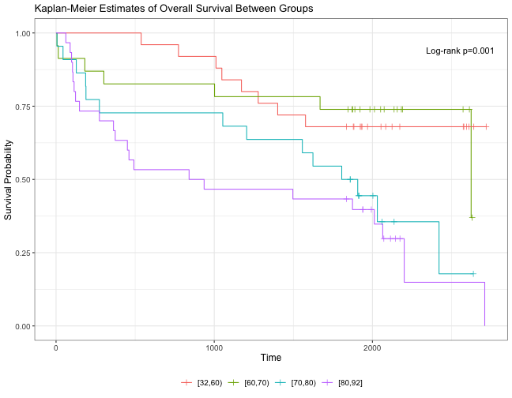

## Hypothesis Test Summary

**Null Hypothesis:** Survival curves are identical across all groups of `agecat`.

**Alternative Hypothesis:** At least one survival curve differs.

| Statistic | Value |
|---|---|
| &chi;&sup2; statistic | 15.57 |
| Degrees of freedom | 3 |
| p-value | < 0.01 (&#42;&#42;) |
| Decision | Reject Null Hypothesis at &alpha; = 0.05 |

## Background and Methods

This analysis examines whether survival times &mdash; measured in days from hospital admission (`lenfol`) until death (`fstat = 1`) or administrative censoring (`fstat = 0`) &mdash; differ across four age categories (`agecat`): [32,60), [60,70), [70,80), and [80,92]. Because `agecat` has four levels, the **log-rank test with Bonferroni correction** was applied to control the family-wise error rate across pairwise comparisons. The log-rank test was selected as the appropriate non-parametric test for comparing survival curves across independent groups. Three key assumptions underlie this analysis: **(1) Proportional Hazards** &mdash; the hazard ratio between any two groups remains approximately constant over time; **(2) Non-Informative Censoring** &mdash; the reason a subject is censored is unrelated to their risk of experiencing the event; and **(3) Independent Observations** &mdash; survival times are independent across individuals.

The overall log-rank test yielded &chi;&sup2;(3) = 15.57, p < 0.01 (&#42;&#42;). We therefore **Reject Null Hypothesis** at significance level &alpha; = 0.05, concluding that at least one age group has a significantly different survival pattern from the others.

## Quantile Table

<table class="table table-striped table-hover" style="width: auto !important; margin-left: auto; margin-right: auto;">
<caption>Survival Quantiles with 95% Confidence Intervals</caption>
 <thead>
  <tr>
   <th style="text-align:left;">   </th>
   <th style="text-align:left;"> Group </th>
   <th style="text-align:right;"> n </th>
   <th style="text-align:right;"> Events </th>
   <th style="text-align:left;"> Median (95% CI) </th>
   <th style="text-align:left;"> Q25 (95% CI) </th>
   <th style="text-align:left;"> Q75 (95% CI) </th>
  </tr>
 </thead>
<tbody>
  <tr>
   <td style="text-align:left;"> groups=[32,60) </td>
   <td style="text-align:left;"> groups=[32,60) </td>
   <td style="text-align:right;"> 25 </td>
   <td style="text-align:right;"> 8 </td>
   <td style="text-align:left;"> NR (1577–NR) </td>
   <td style="text-align:left;"> 1401 (538–NR) </td>
   <td style="text-align:left;"> NR (NR–NR) </td>
  </tr>
  <tr>
   <td style="text-align:left;"> groups=[60,70) </td>
   <td style="text-align:left;"> groups=[60,70) </td>
   <td style="text-align:right;"> 23 </td>
   <td style="text-align:right;"> 7 </td>
   <td style="text-align:left;"> 2624 (2624–NR) </td>
   <td style="text-align:left;"> 1669 (6–NR) </td>
   <td style="text-align:left;"> NR (2624–NR) </td>
  </tr>
  <tr>
   <td style="text-align:left;"> groups=[70,80) </td>
   <td style="text-align:left;"> groups=[70,80) </td>
   <td style="text-align:right;"> 22 </td>
   <td style="text-align:right;"> 14 </td>
   <td style="text-align:left;"> 1856.5 (274–2421) </td>
   <td style="text-align:left;"> 274 (6–1624) </td>
   <td style="text-align:left;"> 2421 (1907–NR) </td>
  </tr>
  <tr>
   <td style="text-align:left;"> groups=[80,92] </td>
   <td style="text-align:left;"> groups=[80,92] </td>
   <td style="text-align:right;"> 30 </td>
   <td style="text-align:right;"> 22 </td>
   <td style="text-align:left;"> 888.5 (363–2065) </td>
   <td style="text-align:left;"> 148 (98–451) </td>
   <td style="text-align:left;"> 2201 (1874–NR) </td>
  </tr>
</tbody>
</table>

*NR = Not Reached. The survival estimate did not decline to the specified percentile during the follow-up period. NR in confidence interval bounds indicates the interval could not be estimated &mdash; too few events were observed for the survival curve to reach that quantile threshold within the follow-up period.*

## Mean Survival Table

<table class="table table-striped table-hover" style="width: auto !important; margin-left: auto; margin-right: auto;">
<caption>Restricted Mean Survival Time with 95% Confidence Intervals</caption>
 <thead>
  <tr>
   <th style="text-align:left;"> Group </th>
   <th style="text-align:right;"> Mean Survival </th>
   <th style="text-align:right;"> SE </th>
   <th style="text-align:right;"> 95% CI Lower </th>
   <th style="text-align:right;"> 95% CI Upper </th>
  </tr>
 </thead>
<tbody>
  <tr>
   <td style="text-align:left;"> groups=[32,60) </td>
   <td style="text-align:right;"> 2200.88 </td>
   <td style="text-align:right;"> 155.17 </td>
   <td style="text-align:right;"> 1896.74 </td>
   <td style="text-align:right;"> 2505.02 </td>
  </tr>
  <tr>
   <td style="text-align:left;"> groups=[60,70) </td>
   <td style="text-align:right;"> 2112.63 </td>
   <td style="text-align:right;"> 208.12 </td>
   <td style="text-align:right;"> 1704.71 </td>
   <td style="text-align:right;"> 2520.55 </td>
  </tr>
  <tr>
   <td style="text-align:left;"> groups=[70,80) </td>
   <td style="text-align:right;"> 1567.26 </td>
   <td style="text-align:right;"> 215.02 </td>
   <td style="text-align:right;"> 1145.82 </td>
   <td style="text-align:right;"> 1988.69 </td>
  </tr>
  <tr>
   <td style="text-align:left;"> groups=[80,92] </td>
   <td style="text-align:right;"> 1219.44 </td>
   <td style="text-align:right;"> 192.02 </td>
   <td style="text-align:right;"> 843.09 </td>
   <td style="text-align:right;"> 1595.80 </td>
  </tr>
</tbody>
</table>

*Mean survival is bounded by the largest observed event time in each group (restricted mean survival time).*

## Pairwise Comparisons (Bonferroni-Adjusted)

<table class="table table-striped table-hover" style="width: auto !important; margin-left: auto; margin-right: auto;">
<caption>Pairwise Log-Rank p-values (Bonferroni-adjusted)</caption>
 <thead>
  <tr>
   <th style="text-align:left;">   </th>
   <th style="text-align:right;"> [32,60) </th>
   <th style="text-align:left;"> [60,70) </th>
   <th style="text-align:left;"> [70,80) </th>
  </tr>
 </thead>
<tbody>
  <tr>
   <td style="text-align:left;"> [60,70) </td>
   <td style="text-align:right;"> 1.0000 </td>
   <td style="text-align:left;"> — </td>
   <td style="text-align:left;"> — </td>
  </tr>
  <tr>
   <td style="text-align:left;"> [70,80) </td>
   <td style="text-align:right;"> 0.1852 </td>
   <td style="text-align:left;"> 0.2148 </td>
   <td style="text-align:left;"> — </td>
  </tr>
  <tr>
   <td style="text-align:left;"> [80,92] </td>
   <td style="text-align:right;"> 0.0072 </td>
   <td style="text-align:left;"> 0.0357 </td>
   <td style="text-align:left;"> 1 </td>
  </tr>
</tbody>
</table>

## Kaplan-Meier Plot

## Plain-Language Interpretation

This analysis examined whether survival times differed among patients in four age groups using data from 100 individuals admitted for acute myocardial infarction. The time variable (`lenfol`) measured the number of days from hospital admission until death or last known follow-up, and patients who did not die during follow-up were treated as censored observations. Because `agecat` has four levels, the log-rank test with Bonferroni correction was applied to control for the elevated chance of false positives that arises when making multiple pairwise comparisons simultaneously.

The p-value &mdash; the probability of observing a difference this large or larger by chance alone, assuming no true difference exists &mdash; was less than 0.01, providing strong evidence against the null hypothesis that all survival curves are identical. In plain language, **older patients died sooner on average**: the [80,92] group had a median survival of approximately 889 days and a restricted mean of 1,219 days, compared to the [32,60) group whose median was never reached within the follow-up period and whose restricted mean was approximately 2,201 days. The Bonferroni-adjusted pairwise comparisons indicate that the [80,92] group was significantly different from [32,60) (p = 0.007) and [60,70) (p = 0.036), while no statistically significant pairwise differences were detected between the two younger groups or between [70,80) and [80,92].

We are 95% confident that the true median or mean survival time for each group lies within the confidence interval shown in the tables above. It is important to note that statistical significance does not by itself imply clinical magnitude &mdash; the observed pattern is consistent with the well-established relationship between advanced age and poorer post-myocardial infarction prognosis, but other confounders (e.g., comorbidities, BMI, sex, treatment intensity) are not accounted for in this univariate analysis, and caution is warranted when drawing causal conclusions.
